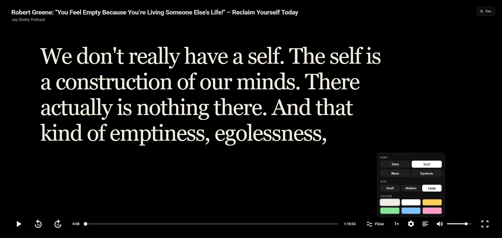
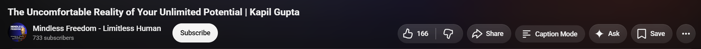
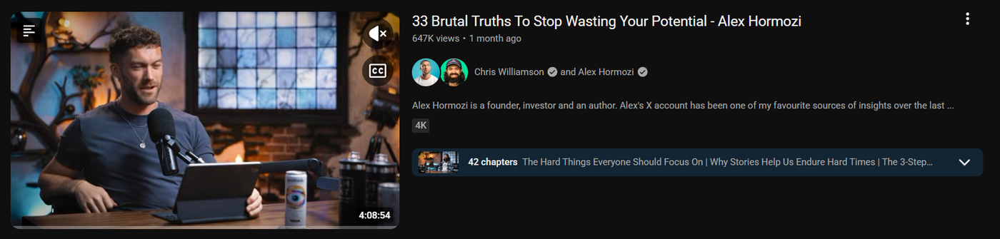
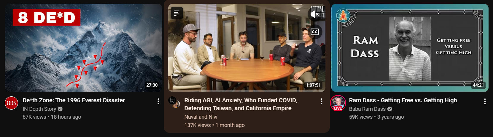

# Caption Mode — read YouTube videos as fullscreen captions

[](https://github.com/sushi057/youtube-fullscreen-captions/actions/workflows/ci.yml)
[](LICENSE)

A free, open-source Chrome extension that turns any YouTube video into a
fullscreen transcript on a black screen. The audio keeps playing. The video, the
thumbnails, the comments, and the sidebar go away.

It is for the times you want what was said, not what was shown: talks, lectures,
interviews, podcasts. It is also for reading in a quiet room, at your own speed,
without a video competing for your attention.



**Good for:** distraction-free YouTube · reading a video instead of watching it
· following lectures and conference talks · podcasts and interviews · reading at
your own pace · dyslexia-friendly fonts and colours · skimming a long video for
the part you need.

Works in Chrome, Edge, Brave, Arc, Opera, and other Chromium browsers on
desktop. No server, no account, no sign-up, no tracking, no configuration.

## Install

Chrome will not install this from a file, so it goes in as an unpacked
extension. It takes about a minute.

### 1. Download

[**Download the ZIP**](https://github.com/sushi057/youtube-fullscreen-captions/archive/refs/heads/main.zip),
then unzip it.

Put the unzipped folder somewhere you will keep it — your Documents folder is
fine. Chrome loads the extension from that folder every time it starts, so if
you delete or move it later, the extension stops working.

### 2. Load it into Chrome

1. Open a new tab and go to `chrome://extensions`
2. Turn on **Developer mode** — the switch at the top right
3. Click **Load unpacked**
4. Select the **`extension`** folder inside the folder you just unzipped

That is it. Open any YouTube video and the **Caption Mode** button is in the row
under the player, next to Share.

> On Edge the address is `edge://extensions` and the switch is called
> **Developer mode** in the left sidebar. On Brave and Opera it is
> `brave://extensions` and `opera://extensions`. Everything else is the same.

### Updating

Download the ZIP again, replace your old folder with the new one, then open
`chrome://extensions` and press **Reload** on the Caption Mode card. Chrome does
not pick up new files on its own.

<details>
<summary>Prefer git?</summary>

```bash
git clone https://github.com/sushi057/youtube-fullscreen-captions.git
```

Load the `extension/` folder as above. To update: `git pull`, then press
**Reload** on the Caption Mode card.

</details>

## Use it

**From a video.** Click **Caption Mode** in the row of buttons under the player,
next to Share.



**From the feed.** Put the pointer on any video in the home feed or in search
results. A small icon appears at the top-left of the picture. One click takes
you straight into Caption Mode for that video.



The icon stays put while YouTube's own preview plays, so you can reach it
without hurrying.



Press `Escape` to leave. The audio never stops when you enter or leave, so you
can move in and out of Caption Mode in the middle of a sentence.

## While you read

The captions are a control, not only text.

- **Click any word** to move the audio to that word.
- **Press `/`** to search the transcript. `Enter` finds the next match,
  `Shift`+`Enter` the previous one, `Escape` closes the search.
- **Open the full transcript** from the control bar to read ahead or jump.

### Keyboard

| Key       | Action                |
| --------- | --------------------- |
| `Escape`  | Leave Caption Mode    |
| `Space`   | Play or pause         |
| `←` / `→` | Back or forward 10s   |
| `↑` / `↓` | Volume                |
| `M`       | Mute                  |
| `F`       | Fullscreen            |
| `/`       | Search the transcript |

These win over YouTube's own shortcuts while Caption Mode is open, so `F` makes
the captions fullscreen rather than the player behind them.

### Reading options

The control bar has a text button. It sets:

- **Font** — Sans, Serif, Mono, or Dyslexic
- **Size** — Small, Medium, Large
- **Colour** — Off white, White, Amber, Green, Blue, Pink

Your choice is remembered. So is your position in each video: come back later
and Caption Mode resumes where you stopped.

### Two ways to read

- **Flow** — several lines at once, the current one bright. Good for following
  an argument.
- **Word for word** — one word revealed at a time, like a teleprompter. Good for
  pacing yourself. It needs per-word timing, which comes from YouTube's
  auto-generated captions.

Switch between them from the control bar.

## How it works

Caption Mode draws a black layer over the watch page. It creates no player of
its own — it reads and drives the video already on the page.

That is the whole design, and it is why the awkward parts of a normal embed do
not apply: no blocked autoplay, no ads on a black screen with no controls, no
video that refuses to embed, and never two players fighting over your speakers.

Captions come from YouTube's own caption tracks, fetched from the page itself.
Auto-generated (`asr`) tracks are preferred, because only those carry per-word
timing.

Clicking the icon in the feed is a navigation: it records what you asked for,
loads the watch page, and opens Caption Mode as that page arrives. You never see
the watch page, because the black layer is already over it.

## Questions

**Is it free?** Yes, and open source under the MIT licence. There is no paid
tier, no account, and no sign-up.

**Does it send my data anywhere?** No. There is no server and no analytics. The
captions are fetched from YouTube by your own browser, the same way the watch
page does it. Your reading settings and your place in each video are stored
locally in your browser.

**What permissions does it ask for?** None. The manifest requests no
permissions at all — it only runs on `youtube.com` pages you open yourself.

**Does it work on YouTube Music, Shorts, or embedded videos?** It works on the
normal desktop watch page and the feed. Shorts and embeds elsewhere on the web
are not supported.

**Does it work on mobile?** No. Desktop Chromium browsers only, because mobile
Chrome cannot load extensions.

**Is it on the Chrome Web Store?** Not yet — install it with the steps above.

**Does it download or export the transcript?** Not as a file. You can open the
full transcript in a scrollable panel and read or copy from it.

**Can I read faster than the video plays?** Yes. Open the full transcript and
read ahead, or use the playback speed control. Word-for-word mode also lets you
pace yourself.

**Why is the text sometimes wrong?** The captions come from YouTube's own
automatic speech recognition, so accents, jargon, and crosstalk get mangled the
same way they do in YouTube's own caption track.

**How is this different from YouTube's "Show transcript"?** YouTube's transcript
is a small sidebar panel next to a playing video. Caption Mode replaces the
whole screen with the text, follows along word by word, and lets you choose the
font, size, and colour for comfortable reading.

## Limits

- Desktop YouTube only.
- Videos with no captions cannot be read. Caption Mode says so and gets out of
  your way.
- Videos with only hand-written subtitles fall back to flow mode, because those
  tracks carry no per-word timing.
- Captions come from YouTube's internal API, which YouTube can change.

## The companion site

`site/` is a small server and page that plays a video with captions **without**
the extension. It exists for sharing a video with someone who has not installed
anything.

You do not need it for daily use. The extension does not call it.

```bash
cd site
npm install
npm start          # http://localhost:3000
```

`GET /api/transcript?v=VIDEO_ID` returns phrase-level and word-level segments.
`GET /api/health` fetches a known-good video and answers `503` when the caption
path is broken, so you learn about an outage before your users do.

## Repository layout

```
extension/         The extension. This is the product.
transcript-core/   Caption fetching and parsing, shared, with the tests
site/              The companion site, for people without the extension
docs/design/       Design notes and plans, kept as a record
```

`transcript-core/` is the source of truth for caption handling. `npm run sync`
copies it into the extension and the site, because neither can load a file from
outside its own folder and this repository has no bundler.

## Development

```bash
npm install        # eslint + prettier only, no runtime dependencies
npm test           # transcript parsing, failure handling, cache, feed logic
npm run lint
npm run format     # or format:check
```

Tests use the built-in Node test runner. No framework, and no network.

Changed an extension file? Press **Reload** on the Caption Mode card, as above.

## Contributing

Issues and pull requests are welcome. Run `npm test`, `npm run lint`, and
`npm run format` before opening one — CI runs all three.

If you are reporting a video that will not read, include the link. Captions come
from YouTube's internal API, and the failures are usually specific to how a
particular video's tracks are published.

## License

[MIT](LICENSE)
